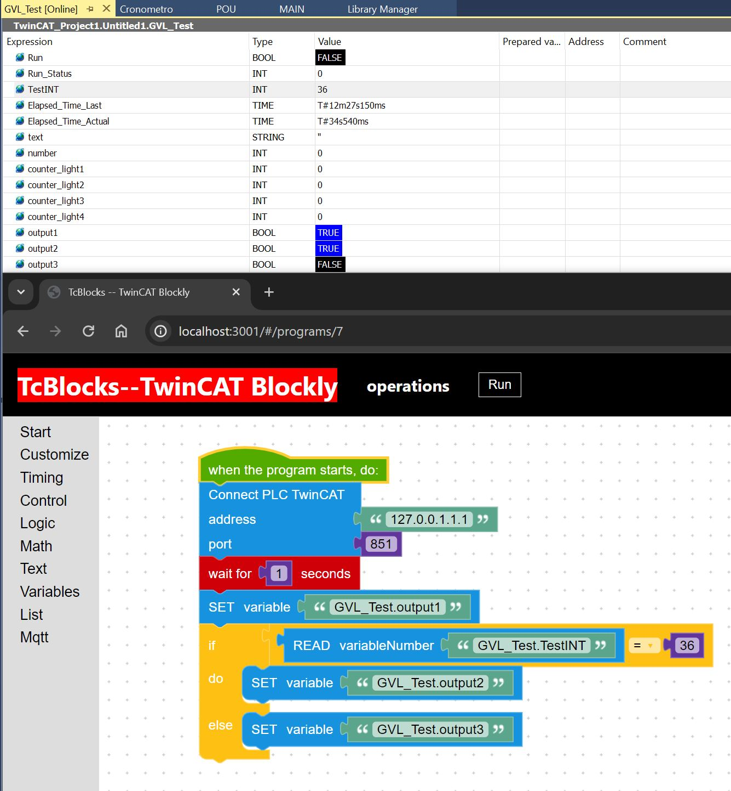
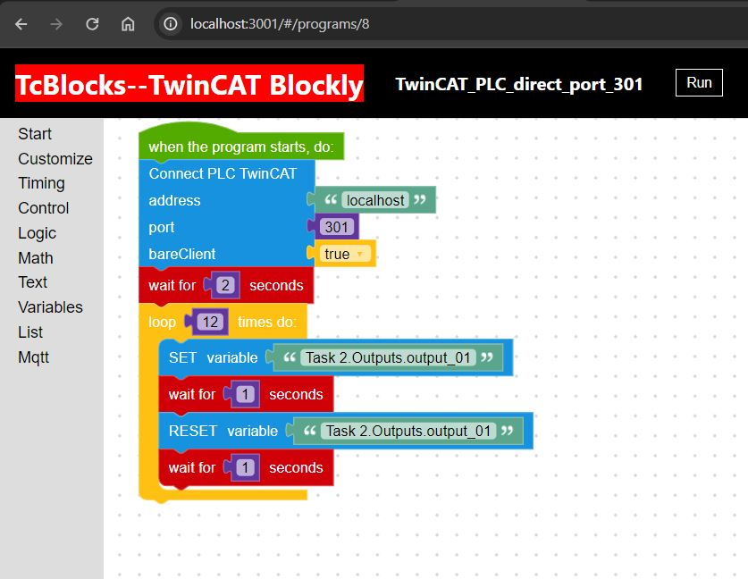

# Blockly Visual PLC Programming Language VPL:

***
### parameter bareclient without PLC, port:301:

- [TwinCAT ports](https://infosys.beckhoff.com/content/1033/tcadscommon/12439473419.html?id=2313713130539198092)
- [TwinCAT Task port 301 and click createsymbols](https://infosys.beckhoff.com/content/1033/tf6100_tc3_opcua/78736395.html?id=4446560320668888306)
***
> [!NOTE]
> ### Setup the dev environment:
- OS: Windows

> ### Beckhoff TwinCAT Shell XAE and XAR:
> download Beckhoff TE1000-twincat-3-engineering:
> - https://www.beckhoff.com/es-es/products/automation/twincat/texxxx-twincat-3-engineering/te1000.html?

> install Beckhoff TwinCAT Shell or previously install visual studio 2017,2019 possible versions community, professional or enterprise and then install TE1000 TwinCAT Shell.

- Docker: Linux, Raspberry. (VM - virtual machine)
***
> [!TIP]
> open project TwinCAT TC3_BlocklyPLC.sln and download
***
> [!IMPORTANT]  
> You have to decide in which software and programming languages ​​to develop the project, for example Node.js+express.js or python, etc...
***
> [!WARNING]  
> first version:

> ### $\textcolor{yellow}{Backend:}$
> - [ ] add Block WaitUntil, idea Robot ABB Rapid..., see manual Rapid
>      - WaitUntil \inpos, b_GripperClosed = TRUE;
>      - WaitUntil \inpos, diGripperClosed = 1;
>      - https://library.e.abb.com/public/688894b98123f87bc1257cc50044e809/Technical%20reference%20manual_RAPID_3HAC16581-1_revJ_en.pdf
>      - https://search.abb.com/library/Download.aspx?DocumentID=3HAC050917-005&LanguageCode=es&DocumentPartId=&Action=Launch
> - [ ] TwinCAT check port 300 IO=ADS device description
> - [ ] operating problem I had to add a 1 sec wait time block after the Beckhoff TwinCAT PLC connect block
> - [ ] add Block read variable type string PLC, and logic_compare two strings.
> - [ ] add Block read variable type float PLC, and logic_compare two float.

> - [ ] Document endpoints swagger

> - [ ] database sqlite export register programm or all programs
> - [ ] database sqlite import register programm or all programs

> - [ ] Blockly add MQTT
>   - [ ] Blockly publish varios topics
>   - [ ] Blockly subscribe various topics and view logger winston
>      - https://github.com/runtimevic/mqtt-node
>      - https://github.com/runtimevic/mqtt-custom-dashboard-node-js
>      - https://github.com/Gr4vity4/mqttws31
>      - https://github.com/Gr4vity4/MQTT-BLOCKLY
>      - https://github.com/frangoteam/FUXA/blob/master/server/runtime/devices/mqtt/index.js
>      - https://github.com/jdiamond/MQTT.ts/tree/master/examples/node-typescript
>      - https://www.emqx.com/en/blog/mqtt-js-tutorial

> - [ ] Blockly add Siemens PLC driver node-snap7...

> - [ ] Blockly motion TwinCAT with PLC.
> - [ ] Blockly motion TwinCAT direct without PLC.

> - [x] connect port: 851
> - [x] paralell process
> - [x] add more Blocks
> - [x] add Block read variable type number PLC and control, and logic
> - [x] add logic_compare and block Read_variableNumber TwinCAT
> - [x] write variable type float => write variable "GVL_Test.TestREAL" value number 12.5
> - [x] write variable type string=> write variable "GVL_Test.TestSTRING" "hello"
> - [x] add Block connect PLC Beckhoff TwinCAT, problem add block after block time 1seg.
> - [x] TwinCAT connect port: 301 without PLC runtime, direct I/O
>      - add parameter bareClient: true/false. By providing bareClient setting, the client connects to the router or target and nothing else. After that, the client can be used to read/write data. However, connection losses etc. need to be handled by the user.

> ### $\textcolor{yellow}{Frontend:}$
> - [ ] TwinCAT connnect parameters change names, targetAmsNetId and targetAdsPort
> - [ ] comments Blocks, tooltip or ...
> - [ ] toolbar customize: divide lightBlocks and PLCTwinCATBlocks.
> - [ ] button export register programm or all programs database sqlite
> - [ ] button import register programm or all programs database sqlite
> - [ ] Select different themes..
> - [ ] Be able to observe the server log on the frontend or Logview file
> - [x] Database sqlite diferents programm, edit, create,delete.
> - [x] toolbox add icons center, zoom+. zoom--
>      - https://developers.google.com/blockly/guides/configure/web/zoom?hl=es-419 

> ### $\textcolor{yellow}{Projects\ Beckhoff\ TwinCAT:}$
> - [x] add project : TC3_BlocklyPLC : Beckhoff TwinCAT without PLC direct port 301 with task.
> - [x] add project : TC3_PLC_Motion : Beckhoff TwinCAT with PLC with motion PLCOpen.

> ### $\textcolor{yellow}{Docker\ Hub:}$
> - [ ] first version Docker image.
> - [ ] Git actions create Docker Hub.
***
> [!CAUTION]
> demo version

